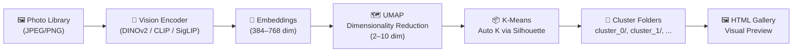

# Photo Organizer

Containerized photo clustering tool using **DINOv2** vision embeddings + **UMAP** dimensionality reduction + **K-Means** clustering. Generates folder-per-cluster output + a self-contained HTML gallery.

Zero local dependencies — everything runs via Docker with **NVIDIA GPU required**.

## Architecture



## Quick Start

```bash
./organize.sh --input /path/to/photos --output /path/to/output
```

### Options

| Flag | Description |
|------|-------------|
| `--input`, `-i` | Input directory with photos (required) |
| `--output`, `-o` | Output directory (required) |
| `--preview` | Run on 10 random photos for quick validation |
| `--dry-run` | Report cluster assignments without writing files |
| `--model` | Vision model: `dinov2-large` (default), `dinov2-base`, `clip`, `siglip` |
| `--umap-components` | UMAP target dimensions (default: 5) |
| `--max-clusters` | Maximum K for silhouette search (default: 20) |
| `--no-faces` | Skip face detection (placeholder) |

### Examples

```bash
# Quick preview on 10 random photos
./organize.sh -i ~/photos -o /tmp/test --preview

# Full run with DINOv2
./organize.sh -i ~/photos -o ~/organized-photos

# Use CLIP instead (lighter, less accurate)
./organize.sh -i ~/photos -o ~/organized-photos --model clip

# Dry run to see cluster distribution
./organize.sh -i ~/photos -o /tmp/out --dry-run
```

## Model Comparison

| Model | Embedding Dim | VRAM | Clustering Quality | Best For |
|-------|:------------:|:----:|:------------------:|----------|
| **DINOv2-large** (default) | 768 | ~1.2 GB | ⭐⭐⭐⭐⭐ | Pure visual similarity |
| DINOv2-base | 768 | ~300 MB | ⭐⭐⭐⭐ | Balanced speed/quality |
| SigLIP | 768 | ~1 GB | ⭐⭐⭐⭐ | Multi-modal tasks |
| CLIP ViT-B/32 | 512 | ~300 MB | ⭐⭐⭐ | Zero-shot text queries |

**DINOv2-large** is the recommended default. It's a self-supervised vision model (Meta) trained only on images — no text bias — making it the best choice for pure visual clustering. Benchmarks show **93% accuracy** vs CLIP's ~28% on image similarity tasks.

All models fit comfortably in 16 GB VRAM.

## Output

```
output/
  cluster_0/
    photo001.jpg
    photo002.jpg
  cluster_1/
    photo003.jpg
    photo005.jpg
  cluster_2/
    photo004.jpg
    photo006.jpg
  index.html    ← Self-contained gallery (open in browser)
```

The HTML gallery is a single file with inline CSS/JS — no external dependencies needed.

## GPU Support

NVIDIA GPU is **REQUIRED** — the tool will fail if no GPU is detected. Docker image builds with:

```bash
# CPU (default)
docker build -t vision-photo-organizer:latest .

# CUDA 12.4
docker build -t vision-photo-organizer:latest \
  --build-arg TORCH_INDEX_URL=https://download.pytorch.org/whl/cu124 .
```

The `organize.sh` wrapper handles GPU detection automatically.

## Requirements

- Docker
- NVIDIA Container Toolkit (for GPU, optional)
- ~16 GB free disk for output

## How It Works

1. **Scan** — Recursively finds all JPG/JPEG/PNG/WEBP files
2. **Embed** — Encodes each image into a high-dimensional vector using DINOv2 (or selected model)
3. **Reduce** — UMAP projects embeddings to 2–10 dimensions, preserving visual similarity structure
4. **Cluster** — K-Means with auto K detection via silhouette score
5. **Export** — Copies images into `cluster_N/` folders
6. **Gallery** — Generates `index.html` with inline lightbox viewer
